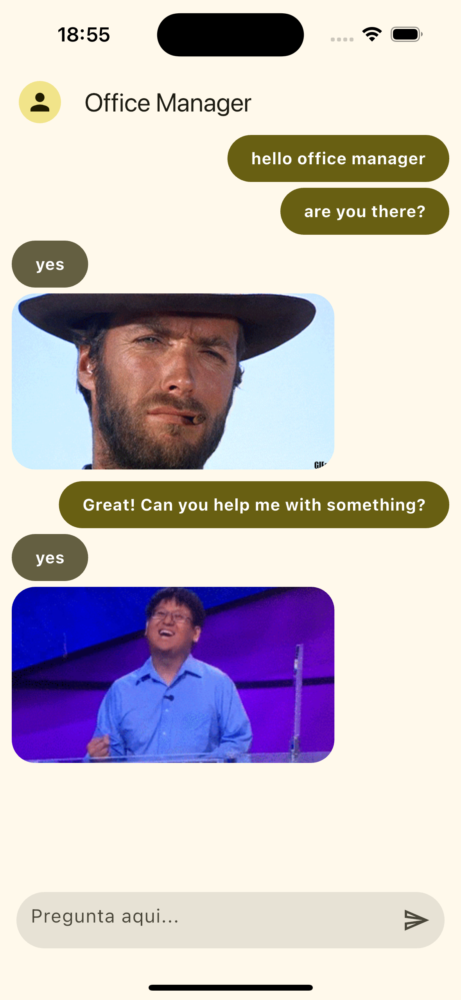

# Yes-No Chat Bot 🤖💬  

A fun and simple chat application where you can ask any question, and the bot will reply with a "Yes" or "No" accompanied by a GIF! Perfect for quick decisions or just having fun with a quirky bot.  

## Features ✨  
- **Interactive Chat**: Ask the bot any question, and it responds instantly.  
- **Yes/No API**: The bot fetches random "Yes" or "No" answers with GIFs for a touch of humor.  
- **Minimalist Design**: A clean and user-friendly interface.  

## How It Works ⚙️  
1. The user types a question into the chatbox.  
2. The app sends a request to the **Yes/No API**.  
3. The API responds with:  
   - A "Yes" or "No" answer.  
   - A related GIF URL.  
4. The app displays the answer and the GIF in the chat window.

## Tech Stack 🛠️  
- **Frontend**: Flutter.  
- **API**: Yes/No API (https://yesno.wtf/api). 

## Demo 🚀  

